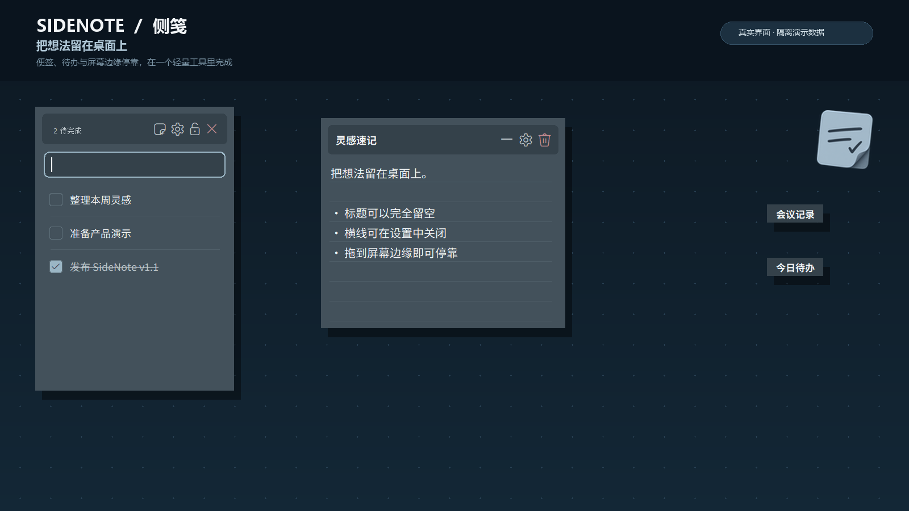
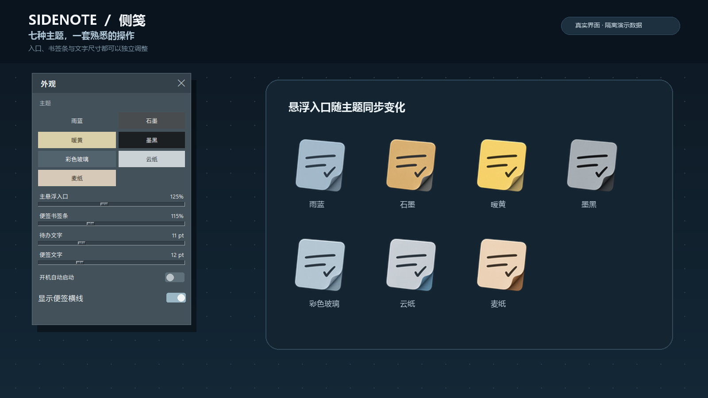
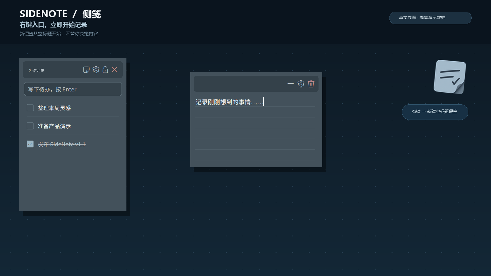
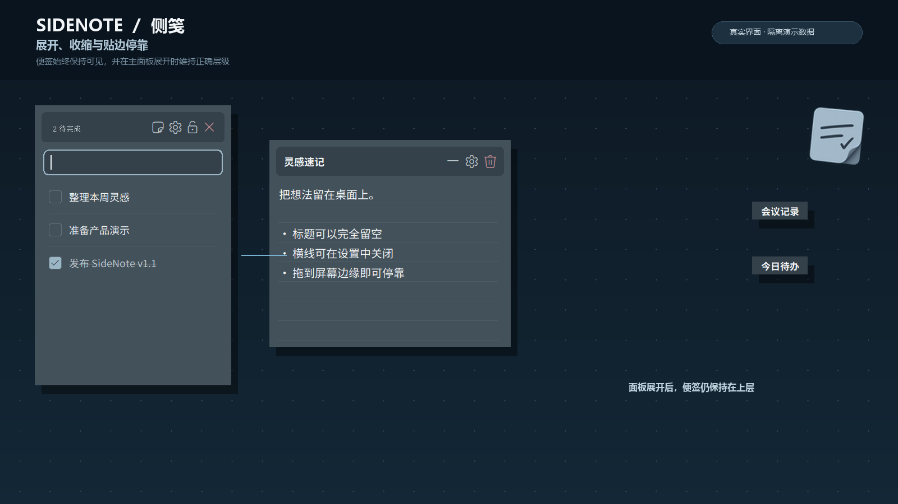

<div align="center">
  
  <h1>侧笺 SideNote</h1>
  <p>把便签、待办和灵感留在桌面边缘。</p>
  <p>
    <a href="https://github.com/ch998244353/SideNote/releases/latest/download/SideNote.exe"><strong>下载最新版 SideNote.exe</strong></a>
    ·
    <a href="https://github.com/ch998244353/SideNote/releases/latest">查看 v1.1.0 发布说明</a>
  </p>
</div>

SideNote 是一款面向 Windows 的轻量桌面便签工具。它常驻在屏幕边缘：左键打开待办面板，右键立即新建便签；便签可以自由展开、收缩和贴边停靠，内容与位置会自动保存在本机。

> v1.1.0 带来全新的便签形悬浮入口、七主题配色、透明无外框显示、真正的空标题便签，以及主面板展开时的窗口层级修复。



## 功能总览

- **快速记录**：右键悬浮入口直接创建便签，标题可以完全留空。
- **桌面便签**：自由移动、调整大小，正文、位置和尺寸自动保存。
- **收缩与停靠**：便签可收缩为标题标签，也可拖到屏幕边缘停靠。
- **待办面板**：添加、完成、删除和拖动排序待办事项。
- **七种主题**：雨蓝、石墨、暖黄、墨黑、彩色玻璃、云纸和麦纸；悬浮入口与主题同步变化。
- **外观设置**：分别调整入口、书签条、待办文字和便签文字大小，并可关闭便签横线。
- **正确窗口层级**：打开主面板后，已展开便签和停靠标签仍保持可见。
- **纯本地运行**：无需安装、账号或网络服务，不含遥测和云同步。

## 真实界面演示

以下画面均由最新版程序配合隔离演示数据生成，未使用模型伪造软件界面，也不包含真实桌面或私人便签内容。

<table>
  <tr>
    <td width="50%" align="center">
      
      <br><strong>七主题与外观设置</strong>
    </td>
    <td width="50%" align="center">
      
      <br><strong>右键快速创建空标题便签</strong>
    </td>
  </tr>
  <tr>
    <td width="50%" align="center">
      
      <br><strong>展开、收缩、停靠与正确层级</strong>
    </td>
    <td width="50%" align="center">
      
      <br><strong>待办、便签、书签条与悬浮入口</strong>
    </td>
  </tr>
</table>

## 快速使用

1. 从 [Releases](https://github.com/ch998244353/SideNote/releases/latest) 下载 `SideNote.exe`。
2. 双击运行，无需安装。首次启动后会在屏幕边缘显示悬浮入口。
3. 左键入口打开待办面板；右键入口直接创建空标题便签。
4. 单击便签标题栏的 `−` 进行收缩；拖动便签到屏幕边缘完成停靠。
5. 在齿轮设置中切换主题、调整尺寸、控制开机启动或关闭便签横线。

升级旧版本时，直接用新版 `SideNote.exe` 替换旧文件即可。现有数据结构没有变化。

## 数据位置与备份

所有便签、待办和设置保存在：

```text
%LOCALAPPDATA%\SideNote\data.json
```

升级 v1.1.0 不会迁移或重置该文件。删除它会清空应用数据，手动操作前请先备份。

## 从源码运行与构建

当前恢复代码对象与 Python 小版本绑定，因此需要 **Python 3.14**。

```powershell
# 直接运行
python src\side_note.pyw

# 测试
python -m unittest discover -s tests -v

# 构建单文件 Windows EXE
python -m pip install -r requirements-build.txt
.\build.ps1
```

构建产物位于 `dist\SideNote.exe`。

## 项目结构

```text
assets/
  floating-entry-themes/      七主题悬浮入口运行时图条
  sidenote-icon.png/.ico      应用与可执行文件图标
docs/images/                  真实程序演示图
src/side_note.pyw             可读启动器与功能补丁层
src/original_side_note.marshal 恢复得到的原主程序代码对象
tests/                        功能与回归测试
build.ps1                     Windows 单文件构建脚本
```

## 源码恢复现状

本仓库由现有 SideNote 可执行文件恢复并继续维护。原始、完整的 `.pyw` 主程序源码不在当前工作区，因此仓库保留了恢复得到的 `src/original_side_note.marshal`，并通过可读的 `src/side_note.pyw` 补丁层修复和扩展功能。

当前版本可以运行、测试和重新构建，但核心主程序还不是完整可读源码。后续维护应逐步把恢复代码迁回普通 Python 源文件；在完成之前，本仓库不宣称已经完整复原全部源码。

## 隐私

SideNote 不包含联网、遥测或云同步逻辑。用户数据只写入本机 `%LOCALAPPDATA%\SideNote\data.json`。仓库演示图使用临时数据目录和无私人内容的示例数据生成。

## 许可证

本项目采用 [MIT License](LICENSE)。
